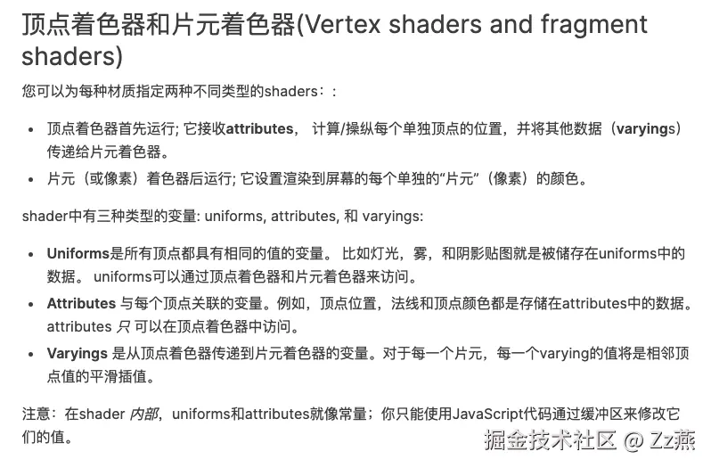
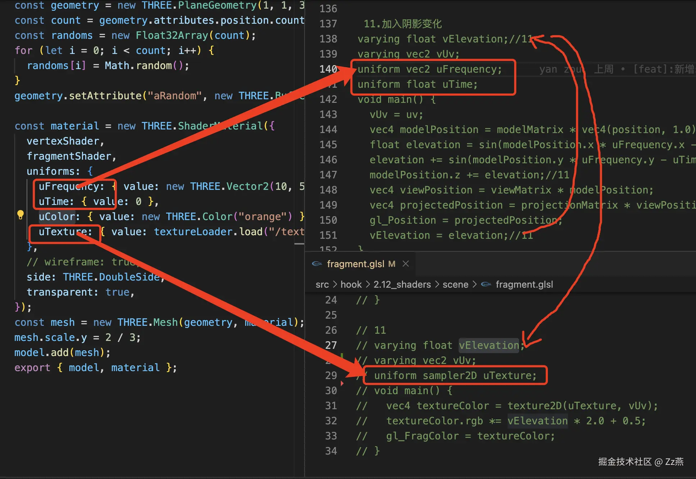

## 2.12_shader着色器小记

### 1、[着色器材质shaderMaterial](https://threejs.org/docs/index.html#api/zh/materials/ShaderMaterial)





### 2、[案例1：Three.js 进阶之旅：Shader着色器入门](https://juejin.cn/post/7158032481302609950)

GLSL：OpenGL Shading Language，语法类似C语言。

#### 2.1 变量

- float：浮点
- bool：布尔
- int：整数
- vec2：二维向量
- vec3：三维向量
- vec4：四维向量

#### 2.2 [内置函数](http://www.bimant.com/docs/glsl-es/acosh/)

- abs(value):取x的绝对值
- sin(value):正弦函数
- cos(value):余弦函数
- step(临界值,value):临界值比value小，返回0，反之，返回1

#### 2.3 顶点着色器（vertex shader）

- `gl_Position` 是一个内置的变量，赋值后就能用，vec4类型，代表顶点位置。
- `modelMatrix`网格相关变换：缩放、旋转、移动；
- `viewMatrix`相机相关变换；
- `projectionMatrix`坐标转化为裁切空间坐标；

```js
void main(){
  gl_Position = projectionMatrix * modelViewMatrix * vec4(position, 1.0);
}

void main(){
  vec4 modelPosition = modelMatrix * vec4(position, 1.0);
  vec4 viewPosition = viewMatrix * modelPosition;
  vec4 projectedPosition = projectionMatrix * viewPosition;
  gl_Position = projectedPosition;
}
```

```js
varying vec2 vUv;
uniform vec2 uFrequency;
uniform float uTime;
void main() {
  vec4 modelPosition = modelMatrix * vec4(position, 1.0);

  modelPosition.z += sin(modelPosition.x * uFrequency.x + uTime) * 0.1;
  modelPosition.z += sin(modelPosition.y * uFrequency.y + uTime) * 0.1;

  gl_Position = projectionMatrix * viewMatrix * modelPosition;
  vUv = uv;
}
```

#### 2.4 片元着色器（fragment shader）

- `gl_FragColor`内置变量，vec4类型，rgba；
- 透明度生效需要在材质中将 `transparent` 属性设置为 `true`；

```js
varying vec2 vUv;
uniform sampler2D uTexture;
void main() {
  vec4 textureColor = texture2D(uTexture, vUv);//将纹理坐标投射到几何体上，返回一个代表rgba 的 vec4
  gl_FragColor = textureColor;
}
```

#### 2.5 定义着色器材质

```js
const material = new THREE.ShaderMaterial({
  vertexShader,
  fragmentShader,
  uniforms: {
    uFrequency: { value: new THREE.Vector2(10, 5) }, //控制波浪频率
    uTime: { value: 0 },
    uColor: { value: new THREE.Color("orange") },
    uTexture: { value: textureLoader.load("/textures/flag.png") },
  },
  side: THREE.DoubleSide,
  transparent: true,
});
```

### 3、[案例2：着色器基础图案+神庙铁球](https://juejin.cn/post/7158628520623603748)

#### 3.1 生成噪音图算法

```js
varying vec2 vUv;
vec2 fade(vec2 t) {
  return t*t*t*(t*(t*6.0-15.0)+10.0);
}
vec4 permute(vec4 x) {
  return mod(((x*34.0)+1.0)*x, 289.0);
}
float cnoise(vec2 P) {
  vec4 Pi = floor(P.xyxy) + vec4(0.0, 0.0, 1.0, 1.0);
  vec4 Pf = fract(P.xyxy) - vec4(0.0, 0.0, 1.0, 1.0);
  Pi = mod(Pi, 289.0); // To avoid truncation effects in permutation
  vec4 ix = Pi.xzxz;
  vec4 iy = Pi.yyww;
  vec4 fx = Pf.xzxz;
  vec4 fy = Pf.yyww;
  vec4 i = permute(permute(ix) + iy);
  vec4 gx = 2.0 * fract(i * 0.0243902439) - 1.0; // 1/41 = 0.024...
  vec4 gy = abs(gx) - 0.5;
  vec4 tx = floor(gx + 0.5);
  gx = gx - tx;
  vec2 g00 = vec2(gx.x,gy.x);
  vec2 g10 = vec2(gx.y,gy.y);
  vec2 g01 = vec2(gx.z,gy.z);
  vec2 g11 = vec2(gx.w,gy.w);
  vec4 norm = 1.79284291400159 - 0.85373472095314 * vec4(dot(g00, g00), dot(g01, g01), dot(g10, g10), dot(g11, g11));
  g00 *= norm.x;
  g01 *= norm.y;
  g10 *= norm.z;
  g11 *= norm.w;
  float n00 = dot(g00, vec2(fx.x, fy.x));
  float n10 = dot(g10, vec2(fx.y, fy.y));
  float n01 = dot(g01, vec2(fx.z, fy.z));
  float n11 = dot(g11, vec2(fx.w, fy.w));
  vec2 fade_xy = fade(Pf.xy);
  vec2 n_x = mix(vec2(n00, n01), vec2(n10, n11), fade_xy.x);
  float n_xy = mix(n_x.x, n_x.y, fade_xy.y);
  return 2.3 * n_xy;
}
void main() {
  float str = cnoise(vUv*10.0);
  gl_FragColor = vec4(vec3(str),1.0);
}
```

#### 3.2 图案47：结合噪声效果图使用`step()`生成奶牛图案

```js
void main() {
  float str = step(0.5,cnoise(vUv*10.0));
}
```

#### 3.3 图案48：结合噪声效果图使用`abs()`生成闪电图案

```js
void main() {
  float str = 1.0 - abs(cnoise(vUv*10.0 - 0.5));
}
```

#### 3.4 图案49：结合噪声效果图使用`sin()`

```js
void main() {
  float str = sin(cnoise(vUv*10.0));
}
```

#### 3.5 图案50：结合噪声效果图使用`sin()`和`step()`生成神庙铁球图案

```js
void main() {
  float str = step(0.5,sin(cnoise(vUv*10.0)));
}
```

#### 3.6 添加颜色

```js
void main() {
  float str = step(0.9,sin(cnoise(vUv*10.0) * 20.0));
  //gl_FragColor = vec4(vec3(str),1.0);
  gl_FragColor = vec4(mix(vec3(0),vec3(vUv,0.2),str),1.0);
}
```

#### 3.7 后期处理（辉光效果）[post-processing](https://threejs.org/docs/index.html?q=post#manual/en/introduction/How-to-use-post-processing)

### 4、[案例3：后期处理+瑞克与莫蒂](https://juejin.cn/post/7166785669866455070)

#### 4.1 加载模型报错

- 存在的可能性：①draco 解压器路径不正确；②draco版本与three.js 不匹配；
- 解决办法：将`node_modules\three\examples\jsm\libs` 下的darco文件夹拷贝到 `public\ `下；

#### 4.2 给部分模型添加辉光效果

- [Three.js图层](http://www.yanhuangxueyuan.com/doc/Three.js/Layers.html)：模型图层必须和相机图层一样，模型才会被渲染出来。一般默认情况下，网格模型和相机默认的图层都是0。
- 设置传送门的层级为1；
- 设置其它模型层级为0；
- renderLoop 中，先渲染传送门再渲染其它模型；

### 5、问题汇总

#### 5.1 解决辉光效果不生效

```ts
renderer.render(scene, camera);
bloomComposer && bloomComposer.render(); //在 renderer.render后面调用才有效
```

#### 5.2 [解决抽离glsl文件引入不成功](https://blog.csdn.net/m0_73495473/article/details/135718623)

1. 安装依赖：`pnpm i vite-plugin-glsl`
2. 配置vite.config.ts

```ts
import glsl from "vite-plugin-glsl";
export default defineConfig({
  plugins: [vue(), glsl()],
});
```

3. 配置vite-env.d.ts

```ts
declare module "*.glsl" {
  const value: string;
  export default value;
}
```

#### 5.3 加载模型报错

1. 存在的可能性：①draco 解压器路径不正确；②draco版本与three.js 不匹配；
2. 解决办法：将`node_modules\three\examples\jsm\libs` 下的darco文件夹拷贝到 `public\ `下；
